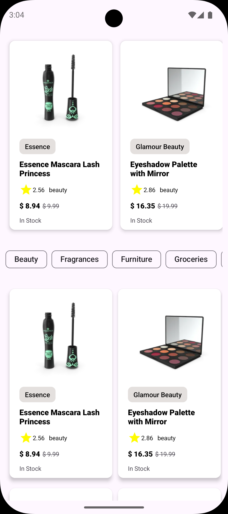

# Multi-View RecyclerView Android App

A modern Android application demonstrating a complex, multi-type RecyclerView implementation using the latest Android development practices.

## 📱 Features
- **Multi-View Layouts**: Efficiently handles different view types (Banners, Categories, Products) within a single RecyclerView.
- **Dynamic Content**: Fetches and displays data using a clean architecture pattern.
- **Material Design 3**: Utilizes Material components like `ChipGroup` for a modern look and feel.
- **Nested Horizontal Scrolling**: Implements horizontal scrolling for Banners and Categories within a vertical list.

## 📸 Screenshots
|                                 Main Screen                                 |
|:---------------------------------------------------------------------------:|
|  |

## 🛠 Tech Stack
- **Language**: [Kotlin](https://kotlinlang.org/)
- **Dependency Injection**: [Hilt](https://developer.android.com/training/dependency-injection/hilt-android)
- **Networking**: [Retrofit](https://square.github.io/retrofit/) & [Gson](https://github.com/google/gson)
- **Image Loading**: [Glide](https://github.com/bumptech/glide)
- **Asynchronous Programming**: [Coroutines](https://kotlinlang.org/docs/coroutines-overview.html) & [Flow](https://developer.android.com/kotlin/flow)
- **Jetpack Components**:
  - ViewModel
  - ViewBinding
  - ListAdapter & DiffUtil
  - Splash Screen API
  - Lifecycle & RepeatOnLifecycle
- **UI Components**:
  - RecyclerView
  - ConstraintLayout
  - CardView
  - Material Chips & ChipGroup

## 🏗 Architecture
The app follows **MVVM (Model-View-ViewModel)** architecture principles to ensure scalability and maintainability.

## 🚀 Getting Started
1. Clone this repository.
2. Open the project in Android Studio (Ladybug or newer).
3. Sync Gradle and run the app on an emulator or physical device.
